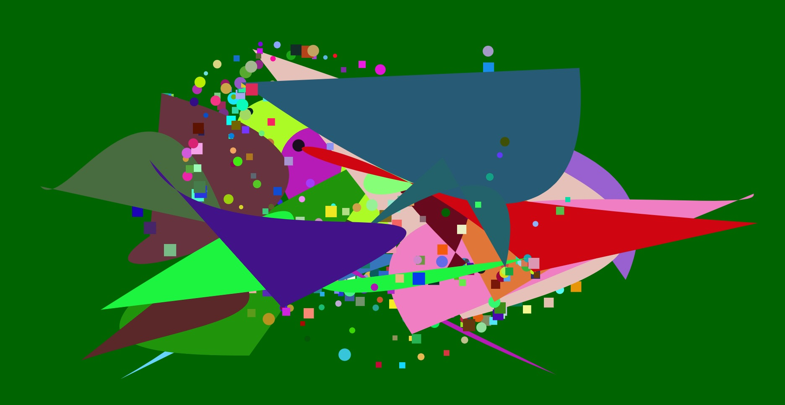

# HW04B
**-My Crazy Crazy Shape Creator**

For this task, I wants to make my shapes dance wildly on my canvas! So I generally created two main drawing functions: bezier() shapes, mousePress() defined its x1,y1 and mouse release defined its x4y4 and all the points in the middle are random. So the player would have a certain level of control, while have some sense of ramdomness; the second function is player can use mouseDrag to draw random circle or rectangle of random size between 10-50 of random color on the canvas... The randomness of shape (circle/rectangle) is the key thing that I played with. I made this by draging a random number between 0-2 and if it is larger than 1 it would be a cirlce, if not, rectangle. 

There are some minor functions also, like use mouse wheel to clear the canvas and use key s to save image.

I think the process of developing both main functions are fun. I tryed to make shape drop after created... but since we are not redrawing the canvas every frame, I am not sure how to do this.. We probably have to use array?

I didn't have a sketch for this one, but here is a demo drawing...
Image on repo:  

